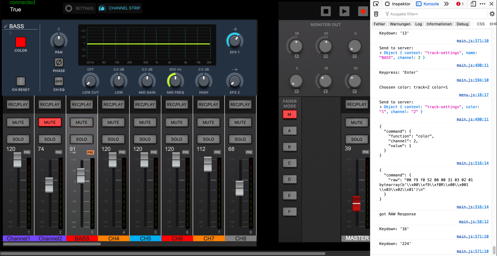

# ZOOM Livetrak L-20 webinterface / MIDI server

With this project, I'm reverse engeneering the midi protocol that the L-20 talks using the BLE-1.

## Project status
* python server is connecting to BLE characteristic, converting the MIDI data
* currently supported MIDI commands:
    - track volume for track 1-19/20 on all 7 groups (master and 6 headphone mixes)
    - toggle mute of a track
    - toggle solo of a track
    - master fader volume and mute
    - rec/play buttons
    - initial loading of track info and volume, solo, mute from device in one bulk sysex message
    - setting track colors (8 colors available like on the iPad App)
    - setting/receiving group volumes (headphone mixes), Note that changs are not persisted and are not saved in a Scene!
* jquery based client similar to the iPad App:



* missing funtionality:
    - FIX server startup on Linux/RaspPi
    - FX tracks are missing yet
    - Track renaming does currently not work
    - Track settings like Send FX1/FX2, PAN, EQ
    - Global EQ
    - Recorder, Project name, folder, Overdub and tempo

## Installation

Use the package manager [pip](https://pip.pypa.io/en/stable/) to install the following libraries:
* websockets
* bleak
* mido

```bash
pip3 install bleak
pip3 install mido
pip3 install websockets
```

## Start the server

```bash
cd server && python3 PyL20_osx.py
```

(Note: Currently for Linux/Windows there must be pairing enabled in the script)

## JQuery client
For the client there probably is a webserver required.
You can use a simple python server:

```bash
cd jquery_client
python3 ../tools/webserver.py
```

Now you can use the client by opening http://localhost:8001 in your browser.


## Contributing

Pull requests are welcome. For major changes, please open an issue first
to discuss what you would like to change.

