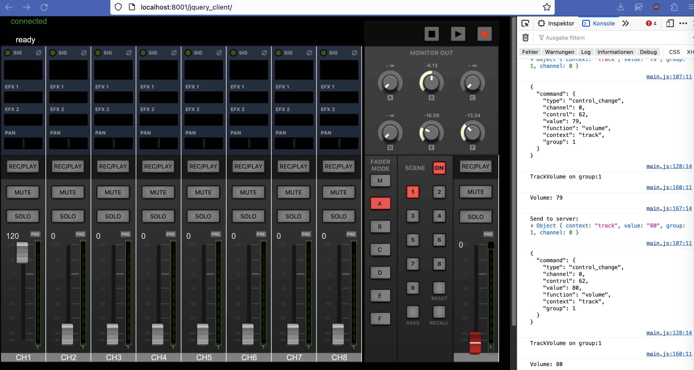

# ZOOM Livetrak L-20 webinterface / MIDI server

With this project, I'm reverse engeneering the midi protocol that the L-20 talks using the BLE-1.

## Project status
* python server is connecting to BLE characteristic, converting the MIDI data
* currently supported MIDI commands:
    - track volume for track 1-6 on all 7 groups (master and 6 headphone mixes)
    - toggle mute of a track
    - toggle solo of a track
    - master fader volume
    - rec/play buttons
* jquery bases client in the layout of the iPad App:


## Installation

Use the package manager [pip](https://pip.pypa.io/en/stable/) to install the following libraries:
* websockets
* bleak
* mido

```bash
pip3 install bleak
pip3 install mido
pip3 install websockets
```

## Start the server

```bash
python3 PyL20_osx.py
```

(Note: for Linux/Windows there must be pairing enabled in the script)

## Contributing

Pull requests are welcome. For major changes, please open an issue first
to discuss what you would like to change.

